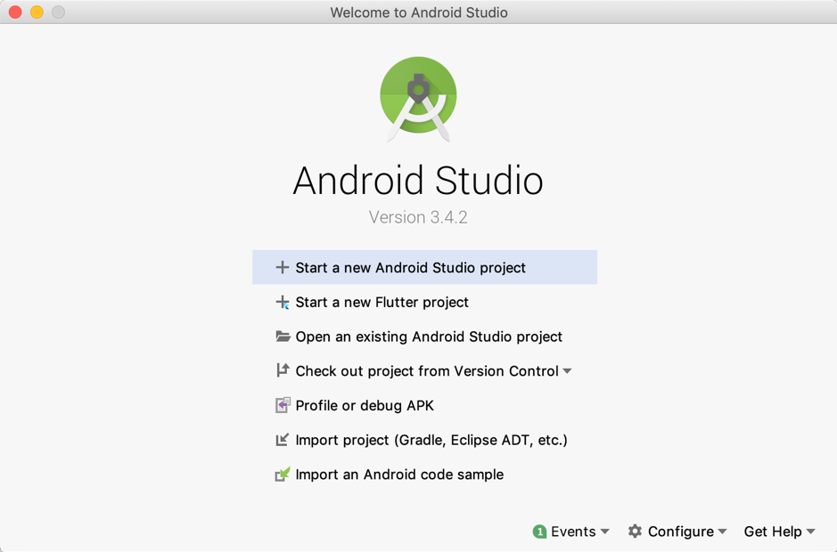
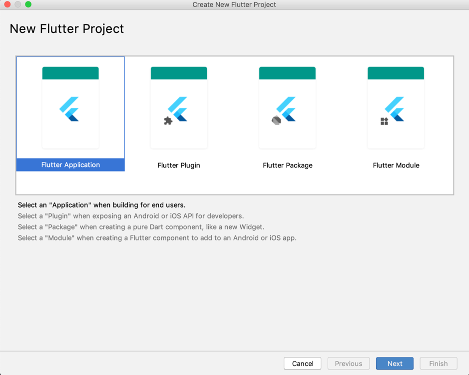
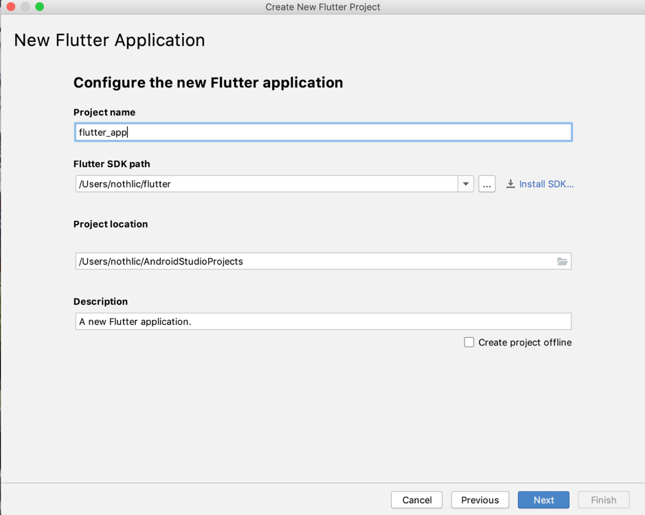
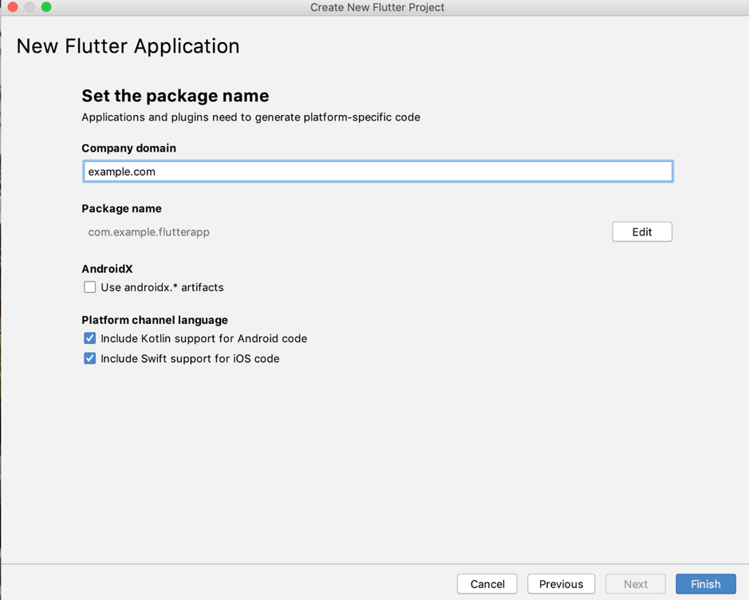
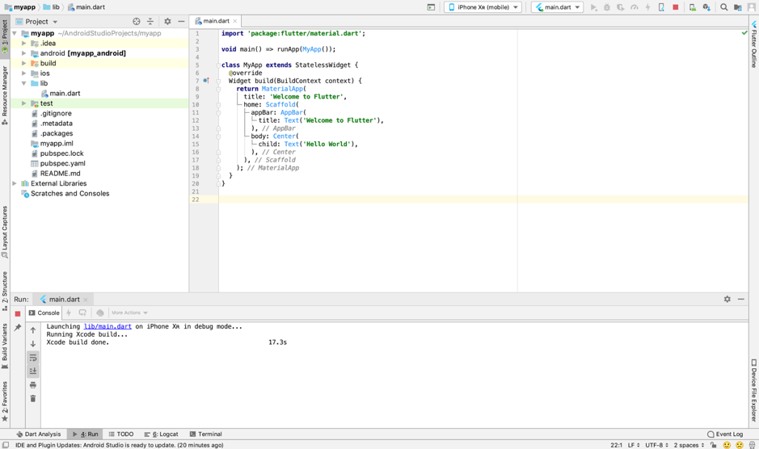
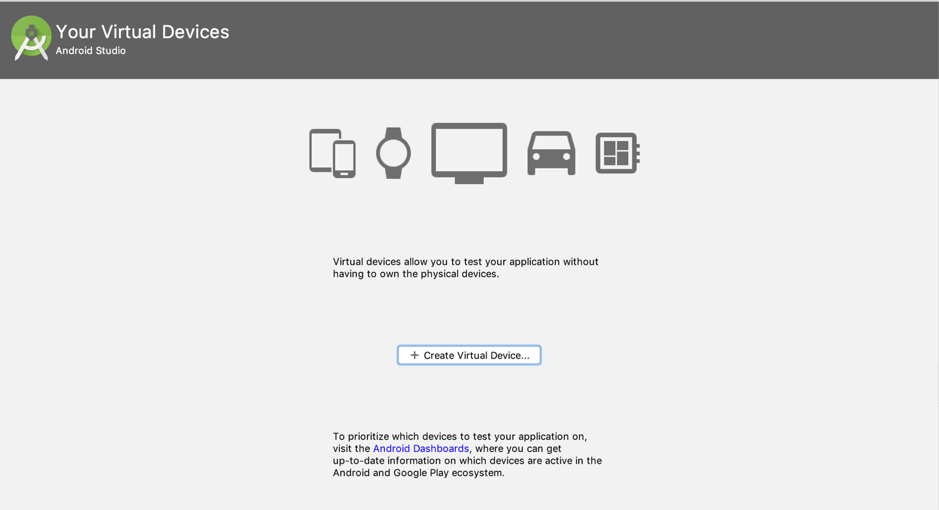
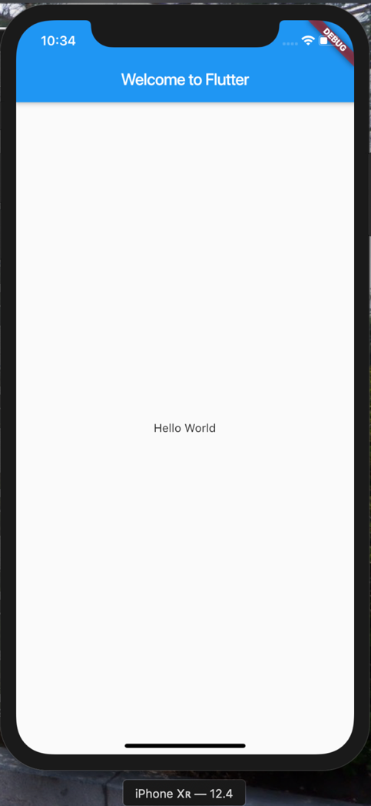

<h1>Install Flutter Di Mac Menggunakan Android Studio</h1>
Catatan untuk melakukan instal menggunakan android studio yang memiliki Ram tidak kecil dan storage lumayan besar. 
<h1>Persyaratan sistem</h1>
Untuk menginstal dan menjalankan Flutter, lingkungan pengembangan Anda harus memenuhi persyaratan minimum ini: 
  •	Sistem Operasi : macOS (64-bit) 
  •	Disk Space : 700 MB (tidak termasuk ruang disk untuk IDE / alat). 
  •	Alat : Flutter tergantung pada alat baris perintah ini yang tersedia di lingkungan Anda. 
  

    &nbsp -	bash  
    &nbsp -	curl  
    &nbsp -	git 2.x  
    &nbsp -	mkdir  
    &nbsp -	rm  
    &nbsp -	unzip  
    &nbsp -	which  
  

<h1>Langkah-langkah instalasi</h1> 
•	Unduh Flutter SDK  
•	Unduh Xcode (IOS) dan Android Studio(Android) 
•	Download plugin dart & flutter 
•	Membuat aplikasi pertama kali 
 

<h1>Mulai instalasi</h1>
•	Download SDK flutter untuk macOS dengan klik disni. 
•	Setelah mendownload SDK tersebut silakan untuk di ekstrak. 
•	Lalu tambahkan PATH flutter dengan membuka terminal dengan langkah ini : 
&nbsp o	Silakan buka terminal lalu copy dan paste di terminal kalian :  

  <b>touch ~/.bash_profile; open ~/.bash_profile</b>   
 
o	Setelah terbuka .bash_profile  silakan kalian copy dan paste :  

  <b>export PATH="$PATH:/Users/nama_user/flutter/bin"</b>  

ganti nama_user dengan user kalian, guna menambahkan path ini agar path tidak berulang-ulang dalam pemanggilan sehingga flutter dapat berjalan secara permanent   

•	Setelah selesai menambahkan PATH flutter, Jalankan perintah berikut untuk melihat apakah ada dependensi yang perlu Anda instal untuk menyelesaikan pengaturan (untuk output verbose, tambahkan -vflag):  

<b>$ flutter doctor</b>  

•	Perintah ini memeriksa lingkungan Anda dan menampilkan laporan ke jendela terminal. Dart SDK dibundel dengan Flutter; tidak perlu menginstal Dart secara terpisah. Periksa output dengan cermat untuk perangkat lunak lain yang mungkin perlu Anda instal atau tugas lebih lanjut untuk dilakukan (ditunjukkan dalam teks tebal )  

  
    

•	Unduh dan instal Android Studio . 
•	Mulai Android Studio, dan buka 'Android Studio Setup Wizard'. Ini menginstal Android SDK terbaru, Android SDK Platform-Tools, dan Android SDK Build-Tools, yang diperlukan oleh Flutter saat mengembangkan untuk Android.  
•	Aktifkan opsi Pengembang dan debugging USB di perangkat Anda. Instruksi lengkap tersedia di dokumentasi Android . 
•	Khusus Windows: Instal Driver USB Google .  
•	Menggunakan kabel USB, colokkan ponsel Anda ke komputer Anda.  Jika diminta pada perangkat Anda, beri otorisasi komputer Anda untuk mengakses perangkat Anda.  
•	Di terminal, jalankan flutter devices perintah untuk memverifikasi bahwa Flutter mengenali perangkat Android Anda yang terhubung. Secara default, Flutter menggunakan versi Android SDK tempat adb alat Anda berada. Jika Anda ingin Flutter menggunakan instalasi Android SDK yang berbeda, Anda harus mengatur ANDROID_HOME environment variabel ke direktori instalasi itu. 

<h1>Mulai Aplikasi Pertama</h1> 
•	Pertama-pertama silakan buka Android Studio :  

  

 

•	Lalu Klik Start a new Flutter project.  

Note : Start a new Flutter project tidak ada silakan anda cek kembali plugin Flutter dan Dart sudah terinstal di android studio. Jika  belum terinstall silakan anda pilih Configure -> <b>Plugins</b> . 
•	Setelah itu akan tampil screenshot dibawah ini :  
 
  

Lalu Klik Flutter Application. 
•	Setelah itu silakan klik Next :   
   

Disini kalian akan diminta untuk menamai Project kalian, Flutter SDK Path, dan Project Location. 

Flutter SDK Path adalah file zip yang telah kalian ekstrak dan masukan lokasi dimana folder tersebut berada. 

•	Setelah kalian selesai silakan klik tombol Next kembali :  
 
    

Disini kalian akan diminta untuk memasukkan Company domain serta Platform yang Support untuk Android dan IOS.
•	Lalu setelah klik Finisih maka akan tampil :  

   
 
•	Silakan anda copy source code dibawah ini dan copy paste di folder lib -> main.dart :  
  
    

•	Setelah selesai lalu silakan klik tombol hijau yang berada di pojok kanan atas :  

  

 
Disini saya menggunakan emulator dari xcode yaitu iPhone Xr , kalian dapat mengganti dengan emulator android yang kalian sukai :  
 
   

•	Jika sudah selesai mari kita lihat hasil dari code diatas pada emulator :   
 
   
 

Maka akan tertampil text Hello World.  
 

Info Lebih Lengkap 
•	Pelajaran : Pemprograman Mobile 
•	Dosen : Ary Budi Warsito 
•	Universitas : Matana University 
•	Penulis : Anton Kurniawan 
•	NIM : 20175520005 

